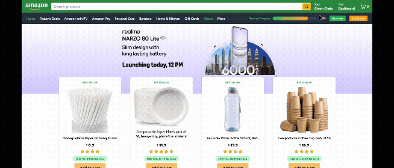
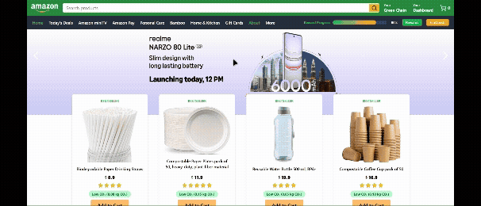

# 🌿 EcoCart – HackOn with Amazon Season 5 Submission

## 🚀 Team: Runtime Terror

**Team Members**  
- Yasharth Shukla  
- Tejash Kapoor  
- Abhinav Saha  

---

## 🌐 Live Demo  
🔗 [EcoCart Website](https://eco-cart-pi.vercel.app/)

---

## 📄 Idea Submission PDF  
[View our original idea submission (PDF)](https://drive.google.com/file/d/1sw9AFPz0XeTjs_cmt93rNBbQG9yb8vQy/view?usp=sharing)

---

## 🌍 Overview

**EcoCart** is a sustainable shopping assistant designed to integrate seamlessly with the Amazon shopping experience. It helps users make climate-conscious decisions by showing real-time carbon footprints, suggesting greener alternatives, and promoting group-based sustainability.

EcoCart aims to **bridge the intent–action gap** in eco-friendly shopping using **gamification**, **behavioral nudges**, and **visual insights** — all while making the experience fun, social, and engaging.

---

## 🌱 Key Features

- 🛒 **Smart Cart with Eco Impact**  
  See your cart’s carbon footprint in real-time and explore eco-friendly product suggestions.

- 📦 **Packaging Optimization**  
  Group products to reduce shipping waste and emissions based on simulated warehouse data.

- 📊 **Personal Impact Dashboard**  
  View your carbon savings, quest progress, and level up.

- 👥 **Green Chain**  
  Form eco-conscious groups with friends/family to complete group quests and save together.

- 🌟 **Eco Score with Breakdown**  
  Products are rated based on Reduce, Reuse, and Resale parameters to help users make better choices.

- 🎯 **Gamified EcoQuests**  
  Complete weekly challenges, earn EcoPoints, unlock badges, and track your streak.

- 💚 **Donation Rounding**  
  Round up your cart total to contribute to verified green initiatives like tree planting or ocean cleanup.

- 🎁 **Eco Reward System**  
  Claim rewards like seed kits as you progress through eco quests and grow your personal green impact.

---

## 🎬 Feature Showcase (Autoplay GIFs)

### 1️⃣ EcoCart Launch Button  

### 2️⃣ Personal Dashboard  

### 3️⃣ Green Chain & CO₂ Group Savings  

### 4️⃣ Gamified EcoQuests + Reward Claim  

### 5️⃣ Eco Alternative Suggestions  

### 6️⃣ Smart Packaging + Round-Up for Donations  

### 7️⃣ ♻️ Eco Score with 3Rs Breakdown  

---

## 🧱 Tech Stack

| Layer          | Tools Used                    |
|----------------|-------------------------------|
| Frontend       | React, Tailwind CSS, Vite     |
| State Mgmt     | Zustand                       |
| Charts         | Recharts                      |
| Routing        | React Router DOM              |
| Deployment     | Vercel                        |

---

## 💡 Next Steps (Beyond Prototype)
- Integration with real Amazon API (for dynamic product data).
- Backend logic to persist user progress, reward tracking, and CO₂ history.
- Advanced recommendation engine using LLMs for sustainability suggestions.
- Mobile responsiveness and PWA support.

---

